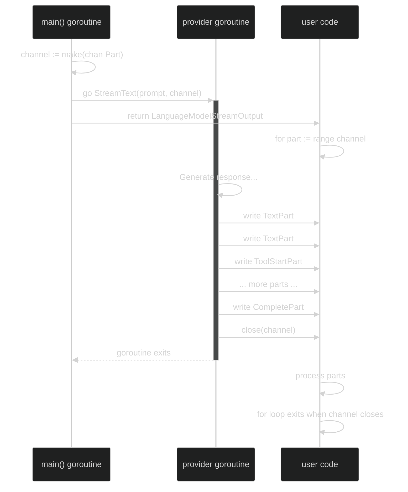

Welcome back! 👋 In Part 1, we built a solid foundation with `GenerateText`—a simple function that gives us complete responses all at once. But here's the problem: **What happens when Claude writes you a 1000-word essay? Or GPT-5 generates a complex JSON response?** Do you really want to wait for the *entire* thing before showing anything to the user?

That's where **streaming** comes in. 🌊

In this part, we'll build `StreamText`—a powerful streaming API that sends responses back *as they're generated*, piece by piece. Along the way, you'll learn about **Go interfaces for polymorphism**, **elegant data modeling**, and the **simplest concurrency pattern Go has to offer**: channels and goroutines.

By the end, you'll understand how real-world AI SDKs handle streaming responses. Let's go! 🚀

## The Problem: "All or Nothing" Isn't Great

With `GenerateText`, here's what happens:

```
User: "Write me an essay"
SDK: *waiting... waiting... waiting...*
User: "Hello? Is anyone there?"
SDK: *still waiting...*
SDK: ✅ Here's your 2000-word essay!
```

This is fine for short responses, but for long-running AI tasks, it feels like the app is frozen. Modern UIs want **real-time updates**—think of ChatGPT typing out responses word by word. That's streaming!

With `StreamText`, we're doing this instead:

```
User: "Write me an essay"
SDK: Here's the first paragraph...
SDK: ...and the second...
SDK: ...and the third...
SDK: ✅ Done!
```

The user gets **immediate feedback** and can start reading while the AI is still thinking. Much better UX! 🎉

## Meet the Part Interface: Polymorphism in Go

Here's the idea of this design. As the AI generates responses, different things happen:
- ✏️ Text gets generated
- 🛠️ Tools get called
- 📊 Steps get taken
- ✅ Everything finishes

Each of these is a different **type** of event. In Go, we represent this with an interface:

```go
type Part interface {
	GetContext() LanguageModelContext
	GetType() PartType
	GetModelName() string
}
```

Now different concrete types implement this:

```go
type TextPart struct { PartImpl; Text string }
type ToolStartPart struct { PartImpl; ToolName string }
type StepEndPart struct { PartImpl; EndPartImpl }
```

Go's **interface-based polymorphism** lets us:
1. Define a single `Part` interface 
2. Create different concrete types that implement it
3. Pass them through a channel without caring which type it is
4. Use a type assertion when we need the specific type

This is the **open/closed principle**—open for extension, closed for modification.

## Digging Into Part Types

Let's look at how parts are actually defined. The core building block:

```go
type PartType string

const (
	PartTypeStart PartType = "start"
	PartTypeEnd   PartType = "end"
	PartTypeText  PartType = "text"

	PartTypeStepStart PartType = "step_start"
	PartTypeStepEnd   PartType = "step_end"

    // And other types
)
```

Each constant represents a different event in the streaming response. Then we have the base implementation:

```go
type Part interface {
	GetContext() LanguageModelContext
}

type PartImpl struct {
	Context LanguageModelContext `json:"context,omitempty"`
}

func (p PartImpl) GetContext() LanguageModelContext {
	return p.Context
}
```

This is **composition** again—every part has a `Context`, so we put it in the base struct once. Now any specific part type (TextPart, ToolStartPart, etc.) can embed `PartImpl` and get these methods for free! 

No copy-paste. No code duplication. Pure Go elegance.

## The EndPart: A Special Case

Some parts are special—they mark the **end** of a response and carry extra information like token usage:

```go
type EndPart interface {
	GetUsage() LanguageModelUsage
	GetFinishReason() FinishReason
}

type EndPartImpl struct {
	Usage        LanguageModelUsage
}
```

When a provider sends a final part, it embeds both interfaces:

```go
type StepEndPart struct {
	PartImpl
	EndPartImpl
}
```

The `StepEndPart` automatically gets all methods from both. Go's elegant version of "multiple inheritance"!

## Go Concurrency: The Channel Pattern

Now for the fun part—the **golden pattern** for Go concurrency:

```go
func StreamText(params StreamTextParams) models.LanguageModelStreamOutput {
	// Ensure we have a provider...
	
	channel := make(chan models.Part)  // Create channel
	go func() {                        // Spawn goroutine
		defer close(channel)
		params.Provider.StreamText(params.Prompt, channel)
	}()
	
	return models.NewLanguageModelStreamOutput(channel, ...)
}
```

**The three key steps:**

1. **Create the Channel**: `make(chan models.Part)` creates an unbuffered typed pipe. Sender blocks until someone receives.

2. **Spawn a Goroutine**: The `go` keyword spawns a lightweight goroutine (much cheaper than threads). The provider writes to the channel as responses stream in. `defer close(channel)` signals when done.

3. **Return the Channel**: The caller gets back a wrapped channel and can iterate without waiting.

### The Critical Role of `defer close(channel)`

**You MUST close the channel when done**, or it causes a dangling goroutine problem:

```go
defer close(channel)
```

The `defer` keyword runs this code when the function exits (even on panic). Without it:
- The `for part := range channel` loop never knows when to stop—it hangs forever
- The provider goroutine becomes a zombie, wasting memory
- The process won't shut down cleanly

**In short:** Closing the channel signals "we're done" to all receivers. Forgetting it = memory leak + hanging app.

**Why This is Brilliant:**
- No locks – channels handle synchronization
- No thread management – goroutines are lightweight
- Clear semantics – easy to reason about
- Memory efficient – no buffering whole responses
- Channel closure signals the end – clean shutdown guaranteed

Compare this to Python's threading/async complexity—Go's philosophy wins!

## How the Consumer Uses This

The beauty is how simple it is for users:

```go
// Call StreamText
output := agentgo.StreamText(agentgo.StreamTextParams{
	Prompt:    "Write a haiku about Go",
	ModelName: "gpt-5-mini",
})

// Iterate over parts as they arrive
for part := range output.Stream {
	switch part.GetType() {
	case models.PartTypeStart:
		fmt.Println("Starting response...")
	case models.PartTypeText:
		textPart := part.(models.TextPart)
		fmt.Print(textPart.Text)  // Print immediately!
	case models.PartTypeEnd:
		fmt.Println("\nDone!")
	}
}
```

Notice how clean this is? The `for part := range channel` automatically handles the blocking—it waits for parts to arrive and stops when the channel closes. This is pure Go elegance.

## Handling Different Part Types: Polymorphism in Action

Here's where the polymorphism shines. As different parts come through the channel, you might want to handle them differently:

```go
for part := range output.Channel {
	// All parts have these common methods
	fmt.Printf("Part Type: %s, Model: %s\n", part.GetType(), part.GetModelName())
	
	// But we can use type assertions for specific handling
	switch v := part.(type) {
	case *models.TextPart:
		fmt.Print(v.Text)
	case *models.ToolStartPart:
		fmt.Printf("Calling tool: %s\n", v.ToolName)
	case *models.CompletePart:
		fmt.Printf("Done! Used %d tokens\n", v.GetUsage().OutputTokens)
	default:
		fmt.Printf("Unknown part type: %v\n", part.GetType())
	}
}
```

This is **Go's type switch**—a safe way to work with polymorphic types. No casting errors, no reflection magic—just clear, explicit code.

## The Data Flow Visualization

Let's visualize how everything works together:



Notice how:
1. The main goroutine doesn't block—it returns the channel immediately
2. The provider goroutine works independently, writing parts as they generate
3. The user can start processing parts while the provider is still working
4. When the provider finishes, it closes the channel, which signals the end

## Why This Design Is Production-Ready

If you look at real SDKs (OpenAI, Google, AWS), they all use variations of this pattern:

### 1. **Non-blocking**
The user's code doesn't wait for everything to be ready. They get results in real-time.

### 2. **Memory Efficient**
No need to buffer the entire response. Each part is processed and discarded.

### 3. **Error Handling Ready**
Parts can include error information. If a tool call fails, you send a `ToolErrorPart`. The consumer can handle it gracefully.

### 4. **Extensible**
Want to add a new part type (like `ToolResultPart`)? Just implement the `Part` interface and send it. Existing code keeps working!

### 5. **Testable**
For tests, you can create a mock provider that sends parts to the channel in a predictable sequence. No actual API calls needed.

## Go's Concurrency Philosophy

This pattern embodies Go's philosophy about concurrency:

> **"Do not communicate by sharing memory; instead, share memory by communicating."**

In other words:
- ❌ Don't use shared variables and locks
- ✅ Use channels to pass data between goroutines

With channels, Go ensures that only one goroutine accesses the data at a time—automatically! This prevents race conditions and makes concurrent code much safer.

## What's Next?

You've now learned:
- **Polymorphism**: Go interfaces make it easy to work with different types
- **Type Assertions**: Safe way to downcast to specific types
- **Channels**: Simple way to communicate between goroutines
- **Goroutines**: Lightweight concurrency that's easy to reason about
- **Composition**: How `PartImpl` and `EndPartImpl` can be embedded

These patterns are exactly what you'll see in production Go code. You're learning real skills! 🎓

In the next part, we'll explore:
- **Part 3**: Message History & Tool Calls—how to build agentic systems with message history, manage multi-turn conversations, and handle tool calls
- Implementing tool definitions and tool result handling
- Building request/response cycles for agents

## TL;DR (What You Just Learned)

- **Streaming**: Send responses piece-by-piece instead of all at once
- **Part Interface**: Define a contract for all streaming response pieces
- **Polymorphism**: Different part types implement the same interface differently
- **Channels**: Go's elegant way to send data between goroutines safely
- **Goroutines**: Lightweight threads that make concurrency simple
- **Type Assertions**: Safe way to work with polymorphic types
- **Composition**: Embed `PartImpl` to share common code across part types

The channel pattern in `StreamText` is literally the simplest, most elegant way to do streaming in any programming language. Go's designers got this right! 💪

Next time you use a streaming API (ChatGPT, Claude, Gemini), know that under the hood, it's probably using this exact pattern—channels sending data as it arrives. You've now built it yourself!

Happy coding! 🚀
