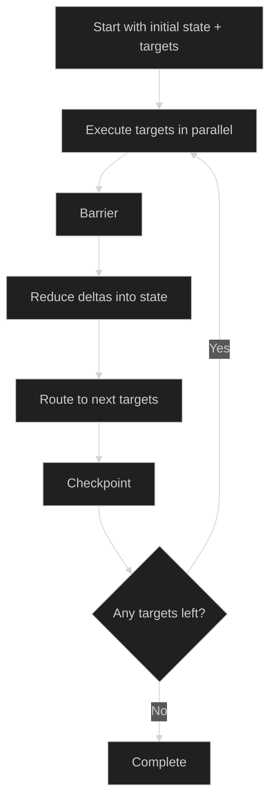
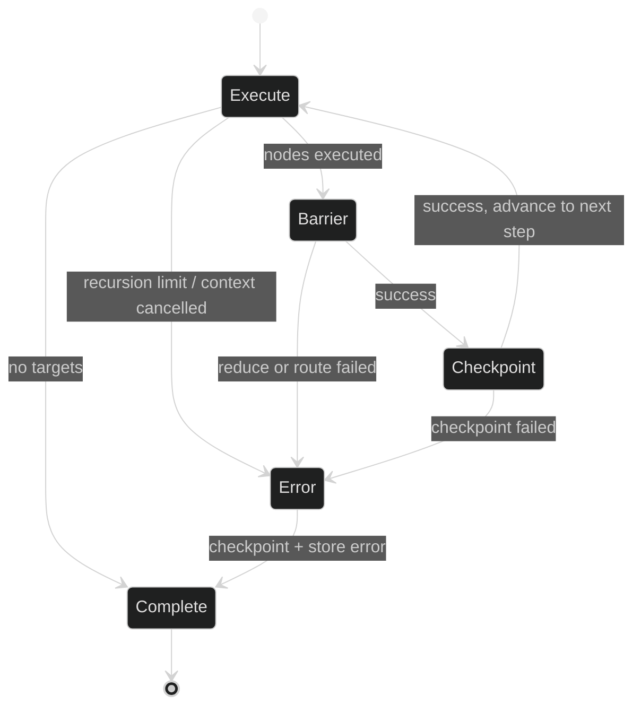

Welcome back. In Part 4, I used a finite state machine (FSM) as the tool-calling loop engine. It worked well: fast to implement, easy to run, and predictable.

But after building more flows, I hit a limit: the FSM loop was too rigid for branching and parallel node execution. So in this part, I switched the orchestration layer to a Pregel-like state graph.

The key point: I did not throw away FSM. I moved it one level down.

- Graph-level orchestration now uses a Pregel-like loop (`graph/graph.go`)
- The loop internals are still executed by a small FSM (`graph/invoke_fsm.go`)

**Code repo:** https://github.com/nquangtrung/agentgo

---

## From Part 4 Graph to Pregel Graph

### Part 4 (Original FSM-centric flow)

The original flow from Part 4 looked like this:


In that version, transitions were explicit and clean, but the loop shape was mostly fixed.

### Part 5 (Pregel-like graph flow)

The new flow uses a Pregel-style superstep model:


This gives better control for fan-out, reduce, route, checkpoint, and resume.

---

## Why FSM Started to Feel Rigid

FSM is great when your process is mostly linear with a few branches. In Part 4, that matched the use case.

As soon as I wanted graph behavior (parallel nodes, dynamic routing, and checkpoint-based resume), state-by-state transitions became harder to scale. Every new path means more transition wiring and more coupling to specific states.

So the change was not "FSM is bad". The change was "FSM is not the right abstraction for graph orchestration at this stage".

---

## New Execution Model (Pregel-like Supersteps)

I now treat one iteration as a superstep:

1. Execute all target nodes (possibly in parallel)
2. Barrier: collect node outputs
3. Reduce outputs into shared state
4. Route to next targets
5. Checkpoint
6. Repeat until no targets

Here is the loop shape:



This model is implemented in `graph/graph.go` with the `StateGraph[T, D]` type and `Invoke` flow.

---

## FSM Is Still There (But as the Inner Engine)

Even after switching to Pregel-style orchestration, the invoke loop itself is still powered by FSM.

- Source: `graph/invoke_fsm.go`
- Mermaid explanation: `graph/invoke_fsm.md`

This is the internal invoke FSM:



So architecturally:

- Outer mental model: Pregel-like state graph
- Inner loop runner: FSM

That split gave me flexibility without rewriting everything.

---

## Quick Code Walkthrough

The `Invoke` method creates invoke context, then runs the FSM loop:

```go
machine := fsm.New[invokeCtx[T, D]]()
if fsmErr := machine.Run(ctx, executeState[T, D]{}, ic); fsmErr != nil {
	return ic.currentStep.input.state, fsmErr
}
```

Inside the FSM states:

- `executeState`: runs current step targets
- `barrierState`: reduce + route via `graph.barrier(...)`
- `checkpointState`: persists step and advances
- `invokeErrorState`: central error handling and checkpoint attempt

This is why I say "FSM is still the engine behind the Pregel graph".

---

## FSM vs Pregel Graph: Pros and Cons

### FSM approach (Part 4 style)

**Pros**

- Very fast to build for linear workflows
- Explicit transitions are easy to read
- Great for deterministic phase-based logic
- State-level unit tests are straightforward

**Cons**

- Gets rigid as branching and dynamic routing grow
- Harder to model fan-out/fan-in naturally
- Parallel execution feels bolted on
- Scaling transitions increases maintenance cost

### Pregel-like graph approach (Part 5 style)

**Pros**

- Natural model for fan-out, barrier, and reduce
- Better fit for concurrent node execution
- Dynamic routing is a first-class concept
- Checkpoint and resume map cleanly to supersteps
- Easier to extend with new nodes/edges than new FSM state chains

**Cons**

- More moving parts (node, edge, reducer, checkpoint)
- Harder to reason about than a tiny linear FSM at first
- Error semantics across parallel nodes need careful design
- Debugging needs better observability (step logs, routing logs)

---

## What Actually Changed in My Design

In Part 4, I mainly asked: "What is the next state?"

Now I ask: "What are the next targets?"

That single shift changed the architecture:

- from phase transitions
- to dataflow routing

And because `Invoke` still runs through `invoke_fsm.go`, I keep the reliability and simplicity of FSM where it matters most: the control loop.

---

## Takeaways

1. FSM was the right choice to get started quickly.
2. Pregel-like graph became the right choice when branching and parallelism grew.
3. This is not a full replacement; it is a layering strategy.
4. FSM still powers the execution loop under `graph/invoke_fsm.go`.
5. The architecture now balances flexibility (graph) and control (FSM).

In the next part, I will cover how interrupts, checkpoints, and resume flow work together in real execution.
