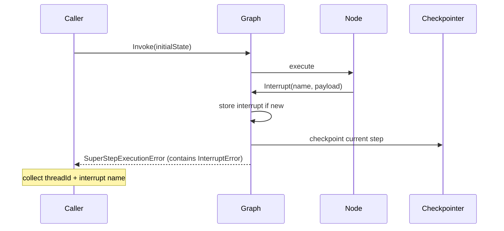

In Part 5, I switched the loop engine to a Pregel-like graph. That gave me better branching and superstep control.

In this part, I will focus on one practical feature that makes the graph usable in real workflows: **interrupt and resume**.

Why this matters:

- Some steps need external approval (human-in-the-loop)
- Some nodes need delayed input (payment confirmation, policy check)
- We want to pause safely, then continue without losing graph state

Code references:

- Interrupt implementation: `graph/interrupt.go`
- Resume implementation: `graph/graph.go` (`Resume`)

---

## What Is an Interrupt in This Graph

An interrupt is a controlled pause requested by a node.

The node calls:

```go
result, err := graph.Interrupt[State, Delta](ctx, "approval-itr", payload)
```

If this is the first time for that interrupt name, the graph stores payload and returns `InterruptError` to stop execution for now.

Core behavior in `graph/interrupt.go`:

- `InterruptError` includes interrupt name, thread ID, and node ID
- `InterruptResult` stores `name`, `payload`, and `Result`
- `Interrupt(...)` checks whether result has been provided
  - no result yet -> return `InterruptError`
  - result exists -> continue execution and return that result

---

## Interrupt Flow (Single Node)



At this point, the graph is paused and the caller gets enough information to continue later.

---

## Resume: Continue from the Last Checkpoint

`Resume` in `graph/graph.go` does three things:

1. Injects external interrupt results into `g.interrupts`
2. Restores checkpoint by `threadId`
3. Re-invokes the graph with restored state, step targets, and partial node results

The important block is:

```go
cp, err := checkpointer.Restore(threadId)

invocationConfig := InvocationConfig[T, D]{
	RecursonLimit:  config.RecursonLimit,
	StartNodes:     cp.Steps,
	ThreadId:       threadId,
	Checkpointer:   checkpointer,
	partialResults: cp.Results,
}
state := cp.State
return g.Invoke(ctx, state, invocationConfig)
```

So resume is not "start over". It is "restart from persisted superstep data".

---

## End-to-End Resume Loop

```mermaid
flowchart TD
    A[Invoke] --> B[Execute superstep]
    B --> C{Interrupt raised?}
    C -- No --> D[Continue normal loop]
    C -- Yes --> E[Return error with interrupt metadata]
    E --> F[Caller collects input/approval]
    F --> G[Resume(threadId, interruptResults)]
    G --> H[Restore checkpoint state + steps + partial results]
    H --> B
```

---

## Multiple Interrupts in the Same Superstep

One interesting case is when multiple nodes interrupt in one superstep.

The tests in `graph/graph_interrupt_test.go` cover this directly (`TestGraphInterruptSameSuperStep`).

Observed behavior from tests:

- A single invoke can surface multiple interrupt names
- Caller can resolve one or more interrupt results per resume call
- Graph continues from the same thread/checkpoint context
- Final output depends on approval/rejection values

This makes the system practical for batch approvals instead of strict one-by-one resumes.

---

## Error Shape and Caller Contract

When interrupted, execution returns a `SuperStepExecutionError` containing one or more `InterruptError` values.

Caller contract is simple:

1. Detect interrupt error
2. Read interrupt names + `ThreadID`
3. Provide decisions/results in a `map[string]any`
4. Call `Resume(...)`

Example pattern from tests:

```go
result, err := g.Invoke(ctx, 0, config)

superStepErr, _ := err.(*SuperStepExecutionError)
interrupts := superStepErr.Interrupts()

result, err = g.Resume(ctx, interrupts[0].ThreadID, map[string]any{
	interrupts[0].Name: "approved",
}, config)
```

---

## Why This Design Works Well

It combines three pieces cleanly:

- **Pregel superstep model** for deterministic execution boundaries
- **Checkpointing** for persistence and replay-safe continuation
- **Interrupt registry** (`g.interrupts`) for external control handoff

And it still reuses the FSM-driven invoke core internally, so control flow stays explicit.

---

## Tradeoffs

Pros:

- Supports human-in-the-loop without custom side channels
- Resume API is explicit and easy to automate
- Thread-scoped continuation avoids losing execution context

Cons:

- Caller must manage thread IDs and interrupt result mapping carefully
- Interrupt naming must be stable and unique enough
- Error handling path is more complex than non-interrupt graphs

---

## Takeaways

1. Interrupt is a first-class pause mechanism, not an ad-hoc error.
2. Resume restores state from checkpoint and continues the same thread.
3. Multiple interrupts per superstep are supported.
4. The design fits real workflows where decisions arrive asynchronously.

In the next part, I will cover patterns for designing interrupt payloads and building safer approval contracts on top of this API.
