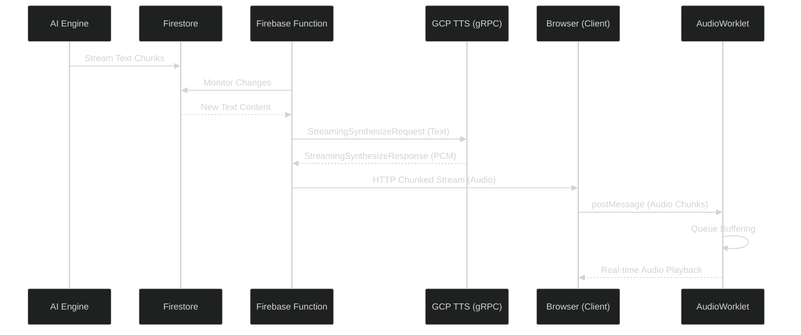

Have you ever chatted with an AI and wished it could talk back in real-time without that awkward "thinking" pause? In this post, I'll walk you through how I built a low-latency streaming Text-to-Speech (TTS) system. The goal is simple: start playing the audio as soon as the first few words are generated, making the experience feel much more natural and responsive.

## 1. The Challenge: Killing the Latency

In traditional TTS systems, the entire text content must be available before synthesis begins. In a chat application where the AI "streams" its response (that cool typing effect), waiting for the full response to finish before starting TTS introduces significant latency—often several seconds.

To provide a seamless experience, we need a system that:

1.  **Starts synthesis** as soon as the first few words are available.
2.  **Continuously feeds** new text into the TTS engine as the AI generates it.
3.  **Streams audio chunks** back to the client for immediate playback.
4.  **Handles audio buffering** in the browser to prevent "glitches" or gaps in speech.

## 2. The Tech Stack: Web Audio & GCP

### AudioContext & AudioWorklet

The Web Audio API's `AudioContext` is our tool for managing the audio pipeline. To ensure high-performance, glitch-free audio playback, I'm using an **AudioWorklet**. Unlike the older `ScriptProcessorNode` which runs on the main UI thread, `AudioWorklet` runs in a separate low-priority thread, preventing UI interactions from causing audio stutters.

Support for `AudioWorklet` is now standard and stable in:

- Google Chrome & Microsoft Edge (Version 66+)
- Apple Safari (macOS and iOS 14.5+)
- Mozilla Firefox (Version 76+)

### GCP Streaming TTS (Bidirectional Data)

I use the Google Cloud Text-to-Speech `streamingSynthesize` API. This is a gRPC-based service that allows for bidirectional streaming:

- **Upstream**: We send `StreamingSynthesizeRequest` objects containing chunks of text as they appear in Firestore.
- **Downstream**: We receive `StreamingSynthesizeResponse` objects containing binary PCM audio data.

## 3. Let's Dive into the Implementation

### System Architecture

Here's a high-level view of how the data flows from the AI engine all the way to your speakers:



### Backend Synthesis: The Conductor

The Firebase function acts as the orchestrator. It establishes a gRPC stream with GCP using the `@google-cloud/text-to-speech` library. This is the Node.js implementation of Google's [bi-directional streaming synthesis](https://cloud.google.com/text-to-speech/docs/create-audio-text-streaming), which allows sending text fragments and receiving audio PCM data concurrently.

The `streamTts` helper simplifies the gRPC event handling into a clean interface. Here's how it's implemented using the npm library:

```typescript
// A simplified look at how streamTts is implemented
async function streamTts({ onChunkReady, onEnded }) {
  const client = new TextToSpeechClient();
  const stream = client.streamingSynthesize();

  // Handle incoming PCM data from GCP
  stream.on("data", (response) => {
    if (response.audioContent) {
      onChunkReady(response.audioContent);
    }
  });

  stream.on("end", () => onEnded());

  // Send stream config only once
  stream.write({
    streamingConfig: {
      voice: {
        // Add your configuration
      },
    },
  });

  return {
    processInput: (text: string) => {
      // Send text bits to the stream as they arrive
      stream.write({
        input: { text },
      });
    },
    endStream: () => stream.end(),
  };
}
```

With the helper established, the main logic monitors and pipes content in:

```typescript
// 1. Initialize synthesis stream and handle chunk delivery
const { processInput, endStream } = await streamTts({
  onChunkReady: (chunk) => {
    // Send binary PCM chunk to client via HTTP stream
    response.sendChunk(chunk);
  },
  onEnded: () => {
    // Signal end of audio stream to client
    response.sendChunk({ type: "signal", event: "end" });
  },
});

// 2. Signal start of synthesis to client
response.sendChunk({ type: "signal", event: "start-synthesis" });

// 3. Monitor Firestore for new content while the message is "Generating"
while (true) {
  const { newContent, noNewContent } = receiveNewContent();

  if (newContent) {
    // Feed new text fragments to GCP as they arrive
    await processInput(newContent);
  }

  if (noNewContent) {
    endStream();
    break;
  }
}
```

### Audio Processing Worklet

The `PCMProcessor` is the heart of the client-side playback. It maintains a queue of incoming audio chunks and ensures that the `AudioContext` always has samples to play by pulling from the queue during each process cycle.

Importantly, it also listens for an `END_OF_STREAM` signal to know when to gracefully stop.

```javascript
class PCMProcessor extends AudioWorkletProcessor {
  constructor() {
    super();
    this.bufferQueue = [];
    this.hasEnded = false;

    // Listen for data or signals from the main thread
    this.port.onmessage = (event) => {
      if (event.data === "END_OF_STREAM") {
        this.hasEnded = true;
      } else {
        this.bufferQueue.push(event.data);
      }
    };
  }

  process(inputs, outputs) {
    const output = outputs[0];
    const channel = output[0];

    if (this.bufferQueue.length === 0) {
      if (this.hasEnded) return false; // Stop the processor once finished
      channel.fill(0); // Play silence if buffer is empty but stream continues
      return true;
    }

    let chunk = this.bufferQueue[0];
    // Copy chunk data to output buffer
    const size = Math.min(chunk.length, channel.length);
    channel.set(chunk.subarray(0, size));

    // Manage the remaining data in the chunk
    this.bufferQueue[0] = chunk.subarray(size);
    if (this.bufferQueue[0].length === 0) {
      this.bufferQueue.shift();
    }

    return true;
  }
}
```

### The Client Pipeline

This helper script sets up the connection between the `AudioWorklet` and a `MediaStreamDestination`. This allows the generated audio to be used like any other media stream in your app.

```typescript
export async function createCustomAudioStream(sampleRate: number) {
  const audioContext = new AudioContext({ sampleRate });
  await audioContext.audioWorklet.addModule("/pcm-processor.js");

  const pcmNode = new AudioWorkletNode(audioContext, "pcm-processor");
  const streamDestination = audioContext.createMediaStreamDestination();

  pcmNode.connect(streamDestination);
  return {
    customStream: streamDestination.stream,
    writeChunk: (data) => pcmNode.port.postMessage(data),
  };
}
```

### Putting it all together: The Orchestration Hook

The hook is where the magic happens. It watches for new messages, calls our Firebase function, and pipes the resulting stream of bytes directly into the audio worklet.

```typescript
const { customStream, writeChunk } = createCustomAudioStream(24000); // GCP TTS LINEAR16 bitrate is 24kHz
onNewMessage((message) => {
  const { stream } = await ttsMessage.stream({ message });

  for await (const chunk of stream) {
    if (chunk.type === "signal") {
      // Handle special signals (like end of stream)
      if (chunk.event === "end") {
        writeEndSequence(); // Signal the worklet to finish up
      }
    } else {
      const uint8Array = Uint8Array.from(chunk.data);
      writeUint8AudioChunk(uint8Array); // Push to our buffering store
    }
  }
});
```

## 4. A Few Pro-Tips (Key Considerations)

- **Normalization and `writeUint8AudioChunk`**: Binary PCM data from GCP typically comes as 16-bit signed integers. You'll need to convert these to 32-bit floats (in the range of -1.0 to 1.0) before the Web Audio API can use them.

  ```typescript
  function writeUint8AudioChunk(uint8Array: Uint8Array) {
    // 1. Convert the 8-bit buffer to 16-bit integers
    const int16Buffer = new Int16Array(uint8Array.buffer);

    // 2. Normalize to 32-bit floats (dividing by 2^15)
    const float32Buffer = new Float32Array(int16Buffer.length);
    for (let i = 0; i < int16Buffer.length; i++) {
      float32Buffer[i] = int16Buffer[i] / 32768.0;
    }

    // 3. Send the normalized chunk to the AudioWorklet
    writeChunk(float32Buffer);
  }
  ```

- **Graceful Shutdown with `writeEndSequence`**: Because it is streaming, we don't know when it ends, so we have to send the end sequence to `pcm-processor`. The processor when receive this signal will in turn tell the stream, and the audio player to stop. This lets it gracefully close the `AudioContext` without any "pops" or "clicks."

  ```typescript
  function writeEndSequence() {
    // Send a plain string signal to the processor
    // so it knows no more data is coming.
    writeChunk("END_OF_STREAM");
  }
  ```

- **Smart Buffering**: The `PCMProcessor` is designed to handle small hiccups in network latency by maintaining a local buffer queue. It’s a lifesaver for keeping the speech smooth!

And there you have it! A fully functional, low-latency streaming TTS system that makes AI interactions feel just a little more human. Happy coding!
