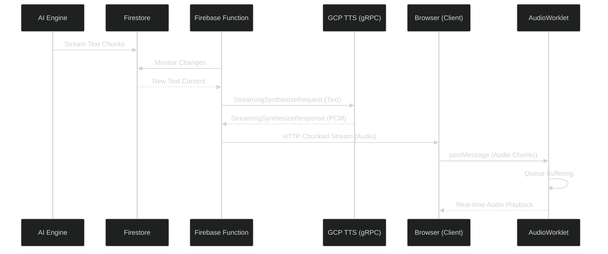

We are trying to describe in this document the technical implementation of the streaming TTS system used in the our applicataion. The goal of this system is to provide low-latency audio feedback for AI-generated chat messages by synthesizing and playing audio while the text is still being generated.

## 1. Introducing the Problem

In traditional TTS systems, the entire text content must be available before synthesis begins. In a chat application where the AI "streams" its response (typing effect), waiting for the full response to finish before starting TTS introduces significant latency (often several seconds).

To provide a seamless experience, we need a system that:

1. Starts synthesis as soon as the first few words are available.
2. Continuously feeds new text into the TTS engine as the AI generates it.
3. Streams audio chunks back to the client for immediate playback.
4. Handles audio buffering in the browser to prevent "glitches" or gaps in speech.

## 2. Technological Background

### AudioContext & AudioWorklet

The Web Audio API's `AudioContext` is used to manage the audio pipeline. To ensure high-performance, glitch-free audio playback, we use an **AudioWorklet**. Unlike the older `ScriptProcessorNode` which runs on the main UI thread, `AudioWorklet` runs in a separate low-priority thread, preventing UI interactions from causing audio stutters.

Support for `AudioWorklet` is standard and stable in:

- Google Chrome & Microsoft Edge (Version 66+)
- Apple Safari (macOS and iOS 14.5+)
- Mozilla Firefox (Version 76+)

### GCP Streaming TTS (Bidirectional Data)

We utilize the Google Cloud Text-to-Speech `streamingSynthesize` API. This is a gRPC-based service that allows for bidirectional streaming:

- **Upstream**: We send `StreamingSynthesizeRequest` objects containing chunks of text as they appear in Firestore.
- **Downstream**: We receive `StreamingSynthesizeResponse` objects containing binary PCM audio data.

## 3. Implementation Details

### System Architecture



### Backend Synthesis

The Firebase function acts as the orchestrator. It establishes a gRPC stream with GCP, monitors the Firestore document for changes in the AI's response, and streams the synthesized audio back to the client using `response.sendChunk`.

```typescript
// 1. Initialize synthesis stream and handle chunk delivery
const { processInput, endStream } = await streamTts({
  onChunkReady: (chunk) => {
    // Send binary PCM chunk to client via HTTP stream
    response.sendChunk(chunk);
  },
  onEnded: () => {
    // Signal end of audio stream to client
    response.sendChunk({ type: "signal", event: "end" });
  },
});

// 2. Signal start of synthesis to client
response.sendChunk({ type: "signal", event: "start-synthesis" });

// 3. Monitor Firestore for new content while the message is "Generating"
while (true) {
  const { newContent, noNewContent } = receiveNewContent();

  if (newContent) {
    // Feed new text fragments to GCP as they arrive
    await processInput(newContent);
  }

  if (noNewContent) {
    endStream();
    break;
  }
}
```

### Audio Processing Worklet (`pcm-processor.js`)

The `PCMProcessor` maintains a queue of incoming audio chunks. It ensures that the `AudioContext` always has samples to play by pulling from the queue during each process cycle.

```javascript
class PCMProcessor extends AudioWorkletProcessor {
  process(inputs, outputs) {
    const output = outputs[0];
    const channel = output[0];

    if (this.bufferQueue.length === 0) {
      channel.fill(0); // Play silence if buffer is empty
      return true;
    }

    let chunk = this.bufferQueue[0];
    // Copy chunk data to output buffer and manage queue...
    channel.set(chunk.subarray(0, channel.length));
    this.bufferQueue[0] = chunk.subarray(channel.length);

    return true;
  }
}
```

### Client Pipeline (`browser-audio.ts`)

The client-side helper sets up the connection between the `AudioWorklet` and a `MediaStreamDestination`, allowing the generated audio to be used like any other media stream.

```typescript
export async function createCustomAudioStream(sampleRate: number) {
  const audioContext = new AudioContext({ sampleRate });
  await audioContext.audioWorklet.addModule("/pcm-processor.js");

  const pcmNode = new AudioWorkletNode(audioContext, "pcm-processor");
  const streamDestination = audioContext.createMediaStreamDestination();

  pcmNode.connect(streamDestination);
  return {
    customStream: streamDestination.stream,
    writeChunk: (data: Float32Array) => pcmNode.port.postMessage(data),
  };
}
```

### Orchestration Hook (`useChatTts.ts`)

The `useChatTts` hook integrates everything. It watches for new messages, calls the Firebase function, and pipes the resulting stream of bytes into the audio worklet.

```typescript
for await (const chunk of stream) {
  if (chunk.type === "signal") {
    // Handle signals here
    if (chunk.event === "end") {
      writeEndSequence(); // Signal the worklet to finish
    }
  } else {
    const uint8Array = Uint8Array.from(chunk.data);
    writeUint8AudioChunk(uint8Array); // Push to buffering store
  }
}
```

## 4. Key Considerations

- **Normalization**: Binary PCM data from GCP is 16-bit signed integers. These must be converted to 32-bit floats (range -1.0 to 1.0) before being used by the Web Audio API.
- **End of Stream**: A special bit sequence (`END_SEQUENCE`) is used to signal the `AudioWorklet` that no more data is coming, allowing it to gracefully close the `AudioContext`.
- **Buffering**: The `PCMProcessor` handles small variations in network latency by maintaining a local buffer queue.
